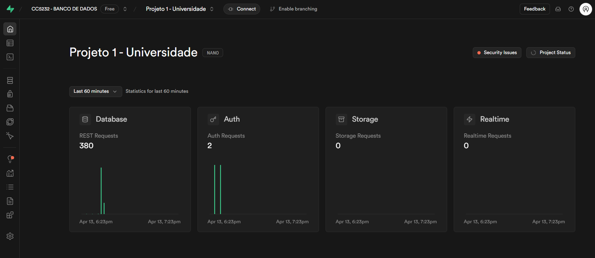

  
# UNIVERSIDADE
## PROJETO 1: BANCO DE DADOS

 

## Introdução
Projeto criado por:
* [Lucas Kerr](https://github.com/Adelgrin) | RA: 221230329
* [Marcela Nalesso](https://github.com/Marcela1204) | RA: 222220113

* Link do git hub: https://github.com/Marcela1204/CC5232_Projeto_1-Universidade/tree/main
* Link do git hub2: https://github.com/Marcela1204/CC5232_Projeto_1-Universidade.git
 

## Descrição do Projeto
- **Objetivo**   
> O objetivo deste projeto é desenvolver e implementar um sistema de banco de dados para uma universidade. O sistema deve ser capaz de armazenar e gerenciar informações essenciais relacionadas a alunos, professores, departamentos, cursos e disciplinas. Além disso, deve contemplar o registro de históricos escolares de alunos, histórico de disciplinas lecionadas por professores e registros de Trabalhos de Conclusão de Curso (TCCs), considerando tanto os grupos de alunos envolvidos quanto os professores orientadores.
 

- **Tabelas** (Mudar a descrição das tabelas)   
> O banco de dados deverá conter as seguintes informações:   
1. Alunos: RA, Nome, Idade, Curso, Semestre.   
2. Professores: ID_Professores, Nome, ID_Departamento.   
3. Departamentos: ID_Departamento, Curso, Coordenador, Chefe de Departamento.     
4. Disciplinas Lecionadas: ID_Disciplinas, Nome do Professor, Disciplina, Curso, Ano de Início, Semestre de Início, Coordenador, ID_Departamento.   
5. Histórico Escolar: ID_Histórico, RA, Disciplina, Nota, Ano, Semestre.   
6. TCCs Apresentados: ID_TCCs, Nome do Aluno, Título, Orientador, Data de Apresentação.

- **Queries** (Colocar as outras queries)
> Para demonstrar o funcionamento do banco, foram usadas as seguintes queries:   
1. Mostre todo o histórico escolar de um aluno que teve reprovação em uma disciplina, retornando inclusive a reprovação em um semestre e a aprovação no semestre seguinte;   
2. Mostre todos os TCCs orientados por um professor junto com os nomes dos alunos que fizeram o projeto;    
3. Mostre a matriz curicular de pelo menos 2 cursos diferentes que possuem disciplinas em comum (e.g., Ciência da Computação e Ciência de Dados). Este exercício deve ser dividido em 2 queries sendo uma para cada curso;    
4. Para um determinado aluno, mostre os códigos e nomes das diciplinas já cursadas junto com os nomes dos professores que lecionaram a disciplina para o aluno;    
5. Liste todos os chefes de departamento e coordenadores de curso em apenas uma query de forma que a primeira coluna seja o nome do professor, a segunda o nome do departamento coordena e a terceira o nome do curso que coordena. Substitua os campos em branco do resultado da query pelo texto "nenhum"
6. Encontre os nomes de todos os estudantes.
7. Liste os IDs e nomes de todos os professores.
8. Encontre os nomes de todos os estudantes que cursaram "Banco de Dados" (course_id = 'CS-101').
9. Encontre os estudantes que cursaram "Ciência da Computação" ou "Engenharia Elétrica".
10. Encontre os estudantes que cursaram "Sistemas de Banco de Dados" mas não "Inteligência Artificial".
11. Recupere os nomes dos estudantes que cursaram disciplinas do departamento de "Matemática".
12. Recupere os IDs dos estudantes que não estão matriculados em nenhum curso do departamento de "Ciência da Computação".
13. Liste os cursos que foram ministrados pelos professores '10' e '11'.
14. Liste os cursos que são ministrados pelo professor '10', juntamente com os títulos dos cursos.
15. Liste os nomes dos estudantes que não cursaram nenhum curso no departamento de "DEEL" (engenharia eletrica).

## Execução do Projeto
Passo a passo para exceutar o projeto: 

### Primeiro passo: Instalar bibliotecas 'Python', 'Faker' e 'Supabase'
- Abra o arquivo criarPopularTabela.py no Codespace do Github e instale as três bibliotecas.

### Segundo passo: Verificar URL e KEY do seu banco
- Copie e cole as chaves URL e KEY do seu banco no supabase (localização detalhada no tutorial abaixo) e substitua nas váriàveis url e key do código.
> Dica: Crie seu próprio banco de dados para que não haja problema com permissão no ‘service role’ ao rodar o código!

### Terceiro passo: Execução do código
- Execute o código e, após aparecer a mensagem 'concluído', é possível localizar os dados no banco!
 

  
**ASSISTA O VÍDEO TUTORIAL ABAIXO**

 

## Diagramas

### MER

### MR

***

